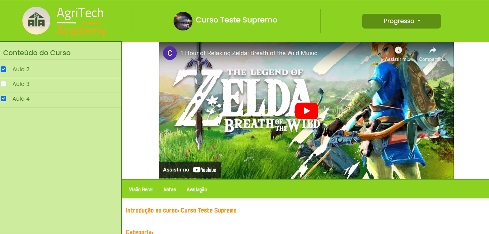
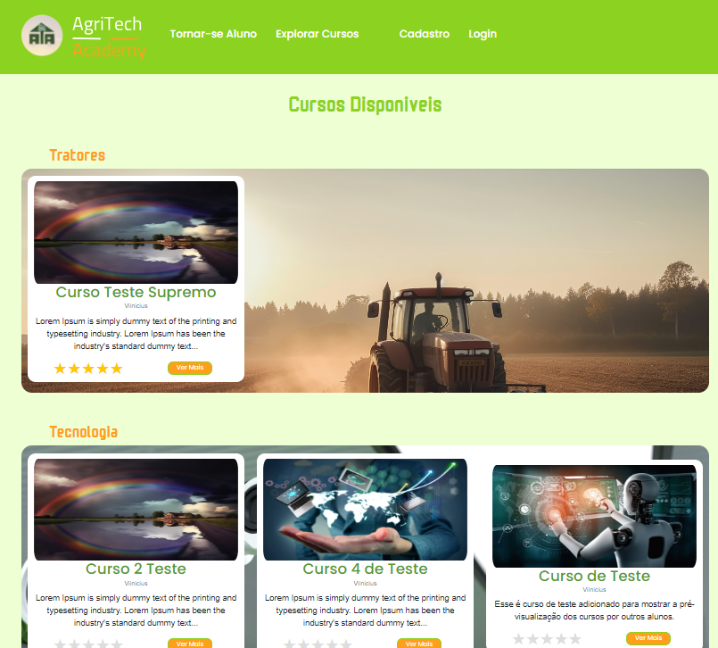
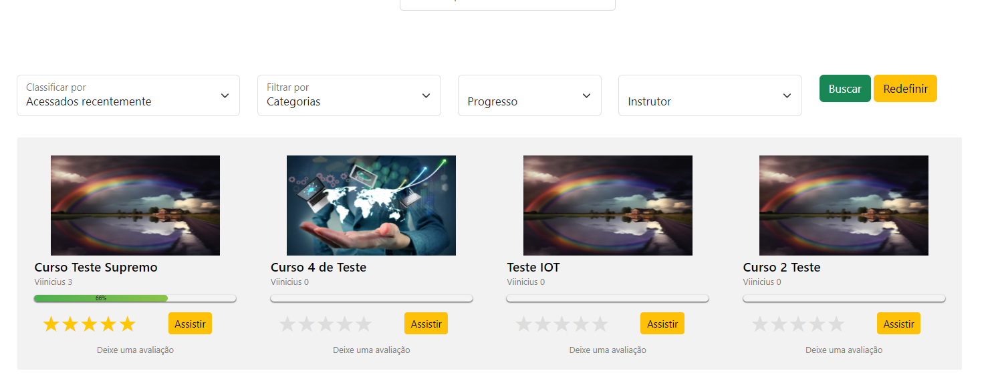
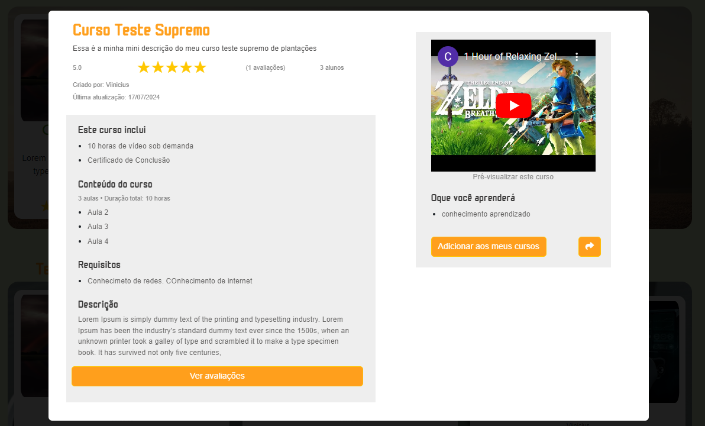

# 🌾 AgriTech Academy

Uma plataforma web inovadora desenvolvida para oferecer cursos de formação complementar aos alunos da Fatec Shunji Nishimura - Pompeia/SP, focando na redução da lacuna entre a formação acadêmica e as demandas da indústria de Tecnologia da Informação (TI).

---

## 📝 Descrição do Projeto
Com o avanço da globalização e as rápidas transformações no mercado de TI, tornou-se evidente a necessidade de complementar a formação acadêmica tradicional. A **AgriTech Academy** surgiu como uma solução para:
- **Facilitar o aprendizado contínuo** através de cursos extraclasse focados em tópicos específicos.
- **Promover a colaboração** com a participação ativa dos alunos como criadores de cursos.
- **Fortalecer o ecossistema de aprendizado** através de interações dinâmicas e compartilhamento de conhecimento.

## 🚧 Dependências Utilizadas

- **axios**: ^1.7.2  
- **bcrypt**: ^5.1.1  
- **bcryptjs**: ^2.4.3  
- **body-parser**: ^1.20.2  
- **cors**: ^2.8.5  
- **ejs**: ^3.1.9  
- **express**: ^4.18.2  
- **express-session**: ^1.17.3  
- **jquery**: ^3.7.1  
- **jsdom**: ^24.0.0  
- **knex**: ^3.1.0  
- **mysql2**: ^3.9.1  
- **nodemon**: ^3.0.1  
- **router**: ^1.3.8  

## 🌟 Funcionalidades
- **Oferecimento de cursos complementares**: Alunos podem acessar conteúdos relevantes e práticos para o mercado.
- **Participação ativa dos alunos**: Os estudantes podem criar cursos, fomentar o compartilhamento de conhecimento e dinamizar o processo educacional.
- **Gerenciamento de usuários**: Cadastro e login seguro utilizando criptografia (bcrypt).
- **Plataforma responsiva**: Totalmente adaptada para dispositivos móveis e desktop.
- **Coméntarios e avaliações**: Os usuários podem fazer comentários em aulas e deixar avaliações nos cursos.

---

## 📖 Pontos de Melhoria
### Melhorias Futuras:
1. **Acompanhamento mais detalhado dos cursos visualizados**: 
   - Monitorar o progresso dos usuários em cada curso.
   - Exibir estatísticas personalizadas para os alunos e instrutores.
2. **Recomendações personalizadas**:
   - Usar algoritmos para recomendar cursos com base no histórico de visualização dos usuários.
3. **Expansão dos recursos colaborativos**:
   - Criar fóruns de discussão integrados a cada curso para debates e trocas de experiências.

---

## 🖼️ Layout e Design
- A plataforma foi projetada utilizando **Bootstrap**, garantindo um design responsivo, moderno e acessível.
- Interfaces simples e intuitivas, facilitando a navegação e interação dos usuários.

---

## 🌟 Imagens do Projeto

### 📚 Tela de Assistir Curso

### 🎓 Tela de Cursos Disponíveis

### 📈 Meu Aprendizado

### 💬 Modal de Informações

